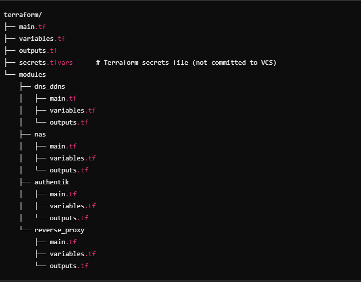
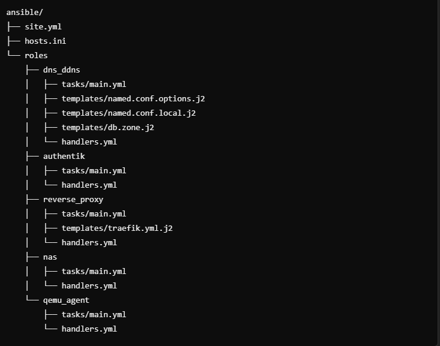

# Proxmox  Environment with pfSense Integration

This project provisions an environment on a Proxmox node using Terraform and Ansible. It is designed to run on a dedicated subnet (10.100.0.0/24) behind a pfSense firewall/gateway.

## Components

- **DNS/DDNS (Bind9 with ddclient):**  
  An LXC container acting as your internal authoritative DNS server for your domain (e.g., example.com) with dynamic DNS updates.

- **NAS (OpenMediaVault):**  
  A QEMU VM running OMV with a static IP (10.100.0.40/24) configured via cloud‑init, including USB passthrough for two external USB HDDs (by serial number) and the QEMU Guest Agent enabled.

- **Authentik:**  
  An LXC container running Authentik with a static IP (10.100.0.20/24).

- **Reverse Proxy (Traefik):**  
  An LXC container running Traefik with a static IP (10.100.0.30/24). Traefik is configured to use Cloudflare’s DNS challenge with wildcard support to obtain certificates for `*.example.com` and `example.com`.

- **QEMU Guest Agent:**  
  Installed on all VMs and LXC containers to improve management.

## Network Design

- **Subnet:** All static IPs are allocated from 10.100.0.0/24.
- **Gateway:** pfSense is set as the LAN gateway at 10.100.0.1/24.
- **Internal DNS:** Bind9 serves as the authoritative DNS for the internal domain (e.g., example.com).
- **Scalability:** Future Proxmox nodes can use additional /24 subnets (e.g., 10.100.1.0/24).

## Directory Structure





## Prerequisites

- **Proxmox VE:** Configured with necessary storage and network bridges.
- **pfSense:** Installed as your firewall/gateway; LAN interface set to 10.100.0.1/24.
- **Terraform & Ansible:** Installed on your local workstation.
- **Cloudflare API Token:** For Traefik’s DNS challenge (secure this via Ansible Vault).
- **USB HDD Serial Numbers:** For USB passthrough to the NAS VM.
- **Secrets Management:** Use Terraform tfvars and Ansible Vault for sensitive information.

## Deployment Steps

### Step 1: pfSense Configuration

1. **LAN Interface:**  
   - Set LAN IP to **10.100.0.1/24** in **Interfaces > LAN**.
2. **DHCP (Optional):**  
   - Enable DHCP under **Services > DHCP Server > LAN** with a pool such as 10.100.0.200–10.100.0.250.
3. **DNS Forwarding:**  
   - Use **DNS Resolver** (Unbound) or **DNS Forwarder** to forward queries to your Bind9 server at **10.100.0.10**.
4. **NAT Port Forwarding:**  
   - Forward TCP ports 80 and 443 from WAN to **10.100.0.30** (Traefik).
5. **Firewall Rules:**  
   - Allow all traffic from the 10.100.0.0/24 subnet.
6. **Static Routes:**  
   - Add static routes for additional node subnets when needed.

### Step 2: Terraform Provisioning

1. Navigate to the `terraform` directory.
2. Ensure your secrets file (`secrets.tfvars`) is set with your sensitive data.
3. Run:
   ```bash
   terraform init
   terraform apply -var-file="secrets.tfvars"
    ```
This will provision:
- DNS/DDNS container at 10.100.0.10/24
- NAS VM (OMV) at 10.100.0.40/24 with USB passthrough
- Authentik container at 10.100.0.20/24
- Traefik container at 10.100.0.30/24


### Step 3: Ansible Configuration
1. Update ansible/hosts.ini with FQDNs (e.g., dns-ddns.example.com, authentik.example.com, traefik.example.com, omv-nas.example.com).
2. Encrypt the Ansible secrets file (secrets.yml) with:
   ```bash
    ansible-vault encrypt ansible/secrets.yml
    ```
3. Run the playbook:
    ```bash
    cd ansible
    ansible-playbook -i hosts.ini site.yml --extra-vars "@secrets.yml"
    ```
4. Ansible will install the QEMU Guest Agent, configure Bind9 (with ddclient and zone files), deploy Authentik and Traefik, and post‑install tasks for NAS.

### Additional Information
- USB Passthrough:
The NAS VM is configured to passthrough two USB HDDs using their serial numbers. Verify that the Proxmox host detects these devices.
- Dynamic DNS & Certificates:
Traefik uses Cloudflare’s DNS challenge to request wildcard certificates for *.{{ domain }} and {{ domain }}.
- Internal DNS:
Bind9 is authoritative for your internal domain (e.g., example.com). Use FQDNs for all service access.
- Scalability:
This node uses the 10.100.0.0/24 subnet. Additional nodes can use different /24 subnets (e.g., 10.100.1.0/24).

## License
This project is licensed under the MIT License.

Contact
For questions or support, please contact **Tshepo Riba** at **tshepo@tsheporiba.co.za**.

## 6. Manual Steps Summary

1. **pfSense Setup:**  
   - Configure LAN interface to **10.100.0.1/24**.  
   - Optionally enable DHCP on LAN (pool 10.100.0.200–10.100.0.250).  
   - Set up DNS forwarding to **10.100.0.10**.  
   - Create NAT port forward rules for TCP ports 80/443 to **10.100.0.30**.  
   - Add firewall rules allowing traffic from 10.100.0.0/24.  
   - Configure static routes for additional Proxmox node subnets if needed.

2. **Terraform Provisioning:**  
   - In the `terraform` directory, run `terraform init` then `terraform apply -var-file="secrets.tfvars"`.  
   - This provisions the DNS/DDNS container, NAS VM with USB passthrough, Authentik container, and Traefik container with static IPs in 10.100.0.0/24.

3. **Ansible Configuration:**  
   - Update `ansible/hosts.ini` with the FQDNs that will be resolved via your internal DNS.  
   - Encrypt the secrets file and run `ansible-playbook -i hosts.ini site.yml --extra-vars "@secrets.yml"`.  
   - This configures Bind9, ddclient, installs the QEMU Guest Agent, deploys Authentik and Traefik, and displays NAS post‑install instructions.

---


